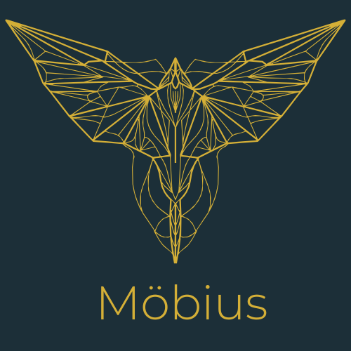

# Mobius Mobile Device Management Platform



[](https://github.com/NotAwar/Mobius/actions/workflows/build-and-deploy.yml)
[](https://github.com/NotAwar/Mobius/actions/workflows/unit-tests.yml)

Mobius is a modern, API-first Mobile Device Management (MDM) platform designed for self-hosted environments. It provides comprehensive device management, policy enforcement, and application distribution across Windows, macOS, Linux, iOS, and Android devices.

## 🚀 Quick Start

### Start the API Server

```bash
# Build and run the API server
cd mobius-server
go build -o mobius-api ./cmd/api-server/
./mobius-api
```

The server starts on `http://localhost:8081` with these default credentials:
- **Email**: `admin@mobius.local`  
- **Password**: `admin123`

### Test the API

```bash
# Health check
curl http://localhost:8081/api/v1/health

# Login and get token
curl -X POST http://localhost:8081/api/v1/auth/login \
  -H "Content-Type: application/json" \
  -d '{"email":"admin@mobius.local","password":"admin123"}'

# Check license status
curl http://localhost:8081/api/v1/license/status \
  -H "Authorization: Bearer <token>"
```

## Architecture Overview

Mobius follows a clean, API-first architecture with clear separation of concerns:

### Core Components

```text
mobius-server/          # Core API server and business logic
├── api/                # HTTP routing, handlers, middleware
├── pkg/service/        # Business logic implementations  
├── cmd/api-server/     # Standalone API server
└── cmd/mobius/         # Legacy server (deprecated)

mobius-cli/             # Command-line management tool
├── cmd/mobiuscli/      # CLI application
└── pkg/               # CLI business logic

mobius-client/          # Device client agents
├── cmd/client/         # Cross-platform device client
└── pkg/               # Client libraries

mobius-cocoon/          # Enterprise web portal
├── cmd/cocoon/         # Web application server
└── pkg/               # Portal business logic

shared/                 # Common libraries and utilities
└── pkg/               # Shared Go packages
```

## Key Features

###  Production Ready
- **RESTful API**: Complete endpoint coverage with OpenAPI 3.1 specification
- **Authentication**: JWT-based auth with role-based access control (admin/operator/viewer)
- **Security**: CORS, rate limiting, security headers, input validation
- **Monitoring**: Health checks, Prometheus metrics, structured logging
- **Containerization**: Optimized Docker images with security best practices

###  Enterprise Features
- **License Management**: Professional, and Enterprise tiers
- **Multi-Platform**: Support for Windows, macOS, Linux, iOS, and Android
- **Policy Engine**: Create, assign, and enforce device policies
- **Application Distribution**: Secure app packaging and deployment
- **Device Management**: Enrollment, monitoring, and remote management

###  Self-Hosted
- **Data Control**: Complete ownership of device and user data
- **Customization**: Open architecture for custom integrations
- **Cost Effective**: No per-device licensing fees to third parties
- **Scalable**: Microservices-ready design for enterprise deployment


## Products

### Mobius Server (`mobius-server/`)

The core backend server that provides:

- **Device Management**: osquery orchestration and MDM protocols
- **REST API**: Complete API for device management operations
- **Web Interface**: Admin GUI is a separate React app that talks to the API
- **Security**: Vulnerability scanning and compliance monitoring
- **Multi-tenancy**: Team-based device organization

**Target Environment**: Deployed on servers/cloud infrastructure

### Mobius CLI (`mobius-cli/`)

Command-line interface for:

- **Configuration Management**: GitOps-style device policy management
- **Server Administration**: Remote server management
- **Data Analysis**: Query execution and data export
- **Automation**: Scripting and integration support

**Target Environment**: Administrator workstations and CI/CD pipelines

### Shared Libraries (`shared/`)

Common utilities used by both products:

- Certificate management
- HTTP client libraries  
- File operations
- Cryptographic utilities

## Installation & Usage

Each product can be built and deployed independently:

```bash
# Build server
cd mobius-server && go build -o ../build/mobius ./cmd/mobius

# Build CLI  
cd mobius-cli && go build -o ../build/mobiuscli ./cmd/mobiuscli
```

## Development

The products are designed with clear separation:

- **Server**: Handles device connections, data storage, and management logic
- **CLI**: Provides administrative interface and automation capabilities
- **Shared**: Common code that both products depend on

This structure enables:

- Independent releases and versioning
- Clear product boundaries
- Focused development teams
- Simplified deployment scenarios

## Security

For security vulnerabilities, responsible disclosure procedures, and security best practices, please see our [Security Policy](SECURITY.md).

Key security features:
- JWT-based authentication with RBAC
- HTTPS/TLS encryption for all communications  
- Rate limiting and DDoS protection
- Comprehensive audit logging
- Vulnerability scanning and dependency management

## License

Mobius is not open source.
